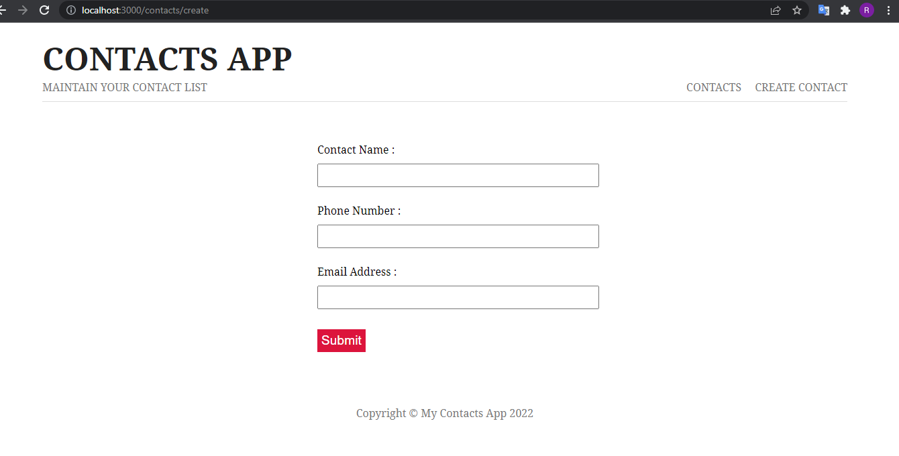
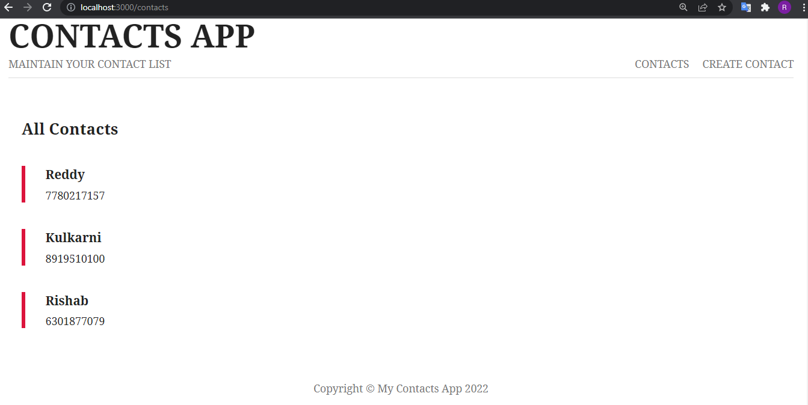
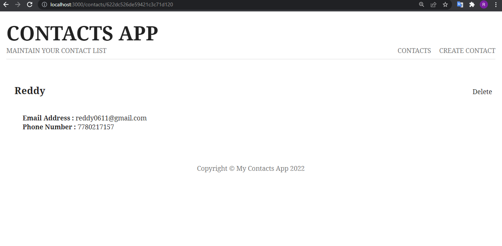

## Contacts App
* A simple CRUD application for managing contacts.

<div align="center">

</div>


## Requirements

* [Node js](https://nodejs.dev/)
* [Visual Studio Code](https://code.visualstudio.com/)


## Usage

Clone it from CLI!

```
$ git clone https://github.com/Rishab-kulkarni/contacts-app
```
Go into the project directory and run the command

```
$ node app.js
```
Or if you have `nodemon` installed for hot reload.

```
$ nodemon app.js
```

Open http://localhost:3000 and enjoy!

## Project Screenshots




